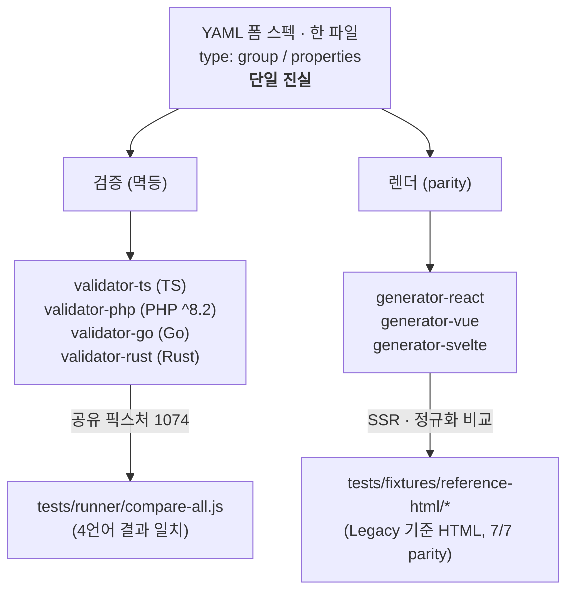

# Form-Spec

[](https://github.com/crudui/crudui/actions/workflows/ci.yml)

YAML 기반 폼 생성 및 검증 시스템 — **다중 언어(4) · 다중 프레임워크(3)**.

하나의 폼 스펙(`type: group` + `properties`)을 단일 진실로 삼아, 같은 정의로
**React/Vue/Svelte** 폼 UI를 렌더링하고 **JavaScript/PHP/Go/Rust** 서버 검증을
수행한다. 핵심 보장은 두 가지다.

- **검증 멱등성** — 같은 스펙·같은 데이터는 4개 언어 어디서나 동일한 결과를
  낸다. 공유 픽스처 **1074 케이스**를 4개 언어에 동시 실행해 결과 일치를
  교차 검증한다(`tests/runner/compare-all.js`). 불일치 시 클라이언트(js)↔서버
  (php/go/rust)·서버끼리 어느 축이 깨졌는지 분류 보고한다("Axis Diagnostics").
- **렌더 parity** — 3개 프레임워크의 출력 HTML이 legacy Legacy PHP 생성기의
  기준 HTML과 바이트 단위로 일치한다(기준 HTML 7종, 각 프레임워크 **7/7**).
  프레임워크끼리도 직접 비교한다(React/Vue/Svelte SSR 21쌍 일치,
  `tests/cross-framework`).

검증 의미론의 단일 진실은 "논리적 올바름"이다(legacy 결함은 보완 대상). 원칙
정의는 [docs/VALIDATION-RULES.md](./docs/VALIDATION-RULES.md)의 "검증 의미론 원칙
(Validation Semantics Principles)" 참조.

## 왜 필요한가

폼 검증은 보통 클라이언트와 서버에 따로 구현되어 규칙이 어긋난다. Form-Spec은
규칙을 YAML 스펙 한 곳에 선언하고, 그 스펙을 모든 런타임이 동일하게 해석하게
만들어 "클라이언트는 통과했는데 서버는 거부"하는 불일치를 구조적으로 없앤다.
legacy Legacy PHP 폼 시스템과의 출력 호환을 유지하므로 기존 자산을 깨지 않고
현대적 스택(React/Vue/Svelte, Go/Rust 백엔드)으로 옮길 수 있다.

## 아키텍처



검증기는 규칙 레지스트리·조건식 파서(lexer+AST, ternary, 상대 경로)·경로
해석기를 각 언어로 포팅한 것이고, 생성기는 프레임워크 무관 PHP-cast 헬퍼
(`legacyParity`)를 공유해 동일 마크업을 낸다. 기준 HTML은
`tools/legacy-baseline`이 핀 커밋(`a47ccba`)의 Legacy 원본으로 재생성한다.

## Packages

npm workspaces 모노레포 (`package.json` `workspaces: ["packages/*"]`).
패키지는 npm/Packagist/crates.io에 **미배포** 상태다 — 저장소 내 워크스페이스·경로
참조로 사용한다.

| 경로 | 패키지명 | 설명 |
|------|----------|------|
| [`packages/validator-ts`](./packages/validator-ts) | `@crudui/validator` | TypeScript 검증 라이브러리 |
| [`packages/validator-php`](./packages/validator-php) | `form-spec/validator` | PHP 검증 라이브러리 (PHP ^8.2, PHPUnit) |
| [`packages/validator-go`](./packages/validator-go) | `github.com/crudui/crudui/packages/validator-go` | Go 검증 라이브러리 |
| [`packages/validator-rust`](./packages/validator-rust) | `formspec-validator` (crate) | Rust 검증 라이브러리 + `validate` CLI |
| [`packages/generator-react`](./packages/generator-react) | `@crudui/generator-react` | React 폼 빌더 — 기준 HTML 7/7 parity |
| [`packages/generator-vue`](./packages/generator-vue) | `@crudui/generator-vue` | Vue 3 폼 빌더 — 기준 HTML 7/7 parity |
| [`packages/generator-svelte`](./packages/generator-svelte) | `@crudui/generator-svelte` | Svelte 폼 빌더 — 기준 HTML 7/7 parity |
| [`packages/generator-core`](./packages/generator-core) | `@crudui/generator-core` | 프레임워크 무관 CRUDUI 코어 — `buildForm`/`buildList`(합성→평가→viewmodel). React/Vue/Svelte 어댑터가 공유 |
| [`packages/form-spec-cli`](./packages/form-spec-cli) | `@crudui/cli` | 오케스트레이터 CLI(`form-spec`) — `describe`/`check`/`explain`/`list-widgets`. 코드·스키마 단일진실을 얇게 래핑(자체 카탈로그 0) |
| [`packages/generator-legacy`](./packages/generator-legacy) | — | legacy Legacy PHP 사본 (기준 HTML 파이프라인용) |

## Quick Start

### 설치 / 빌드

```bash
npm install        # 루트에서: 워크스페이스 일괄 설치
npm run build      # validator-ts + generator-react/vue/svelte 빌드
```

검증기 PHP/Go/Rust는 각 언어 툴체인으로 빌드한다(아래 각 절 참조).

### 스펙 정의

```yaml
type: group
properties:
  email:
    type: email
    label: Email
    rules:
      required: true
      email: true
    messages:
      required: 이메일을 입력하세요
  name:
    type: text
    label: Name
    rules:
      required: true
      minlength: 2
```

### 검증기

같은 스펙·같은 데이터에 대해 네 언어가 동일한 `{valid, errors}`를 낸다.

**JavaScript / TypeScript**

```typescript
import { Validator } from '@crudui/validator';

const validator = new Validator(spec);            // spec: 파싱된 객체
const result = validator.validate(formData);
// result: { valid: boolean, errors: [{ path, field, rule, message, value? }] }
```

**PHP** (^8.2)

```php
use FormSpec\Validator\Validator;

$validator = new Validator($spec);                // $spec: type/properties 배열
$result = $validator->validate($data);            // ValidationResult
$result->valid;                                   // bool
$result->getErrors();                             // 경로 키 에러 배열
```

**Go**

```go
import "github.com/crudui/crudui/packages/validator-go/validator"

parsed, _ := validator.ParseSpec(specJSON)        // 기준 type/properties JSON
v := validator.NewValidator(parsed.Spec)
result := v.Validate(data)                        // result.IsValid, result.Errors
```

**Rust** (`formspec-validator` 크레이트)

```rust
use formspec_validator::{parse_spec, Validator};

let parsed = parse_spec(&spec_json)?;             // serde_json::Value
let mut v = Validator::new(parsed.spec);
let result = v.validate(&data);                   // result.is_valid, result.errors
```

Rust는 크로스언어 러너용 `validate` CLI도 제공한다(stdin `{spec, input}` →
stdout `{valid, error, field}`):

```bash
cd packages/validator-rust && cargo build --release
echo '{"spec":{...},"input":{...}}' | ./target/release/validate
```

위 `validate`는 legacy CLI다. CRUDUI 파이프라인은 네 언어 모두 동형의 `validate` CLI를
제공한다 — stdin JSON `{spec, data, files?, basepath?, mode?}` → stdout
`{valid, errors}` (compose → forbidden-scan → validate). `mode:"list"`는 list-spec
구조 검증(compose + forbidden-scan, 행 데이터 제외)이다. 미해결 `$ref`/`$patch`/
금지키는 `valid:false`가 아니라 `{error, code}` 로드 실패로 구분 보고한다. 진입점은
`packages/validator-ts/bin/validate.mjs` · `packages/validator-php/bin/validate.php` ·
`packages/validator-go/cmd/validate` · `packages/validator-rust/src/bin/validate.rs`.

### 폼 빌더 (렌더러)

세 프레임워크가 같은 스펙에서 동일한 Legacy 호환 HTML을 생성한다.

**React**

```tsx
import { FormBuilder } from '@crudui/generator-react';

function App() {
  return (
    <FormBuilder
      spec={spec}                                  // YAML 문자열 또는 파싱된 객체
      language="ko"
      onSubmit={(data, errors) => console.log(data, errors)}
    />
  );
}
```

**Vue 3** (SSR 예시)

```ts
import { createSSRApp, h } from 'vue';
import { renderToString } from '@vue/server-renderer';
import { FormBuilder } from '@crudui/generator-vue';

const app = createSSRApp({
  render: () => h(FormBuilder, { spec, data: {}, language: 'ko' }),
});
const html = await renderToString(app);
```

**Svelte**

```svelte
<script>
  import { FormBuilder } from '@crudui/generator-svelte';
  export let spec;
</script>

<FormBuilder {spec} language="ko" />
```

API 상세는 [docs/API.md](./docs/API.md) 참조.

## form-spec CLI

`@crudui/cli`(`form-spec`)는 코드·스키마 단일진실 위에 얇게 얹힌 오케스트레이터다 —
손으로 베낀 카탈로그가 없다. 현재 구현된 서브커맨드는 네 개다.

```bash
form-spec describe [--json|--md]    # 코드·스키마 import·parse → 통합 capability (위젯·규칙·list 포함, drift 0)
form-spec check <spec.{yml,json}>   # 메타스키마(ajv) + forbidden-scan + type 카탈로그 정합
form-spec explain <spec> [--lang ko|en]  # 스펙 → 자연어 역검증
form-spec list-widgets [--json]     # 위젯 kind + layout + alias
```

`validate`/`render`/`scaffold`는 로드맵이며 아직 미구현이다. 설계·위임 구조는
[docs/FORM-SPEC-CLI.md](./docs/FORM-SPEC-CLI.md), MCP 노출은
[docs/FORM-SPEC-MCP.md](./docs/FORM-SPEC-MCP.md) 참조.

## list-spec (read 자매)

form-spec이 입력(write)이면 list-spec은 그 read 자매다 — 같은 양식을 재사용해 목록을
선언한다(루트 `columns` + `rows` 주입). DB에 접속하지 않는다: 행 데이터는 호출자가
주입하므로 데이터 소스와 무관하다. `@crudui/generator-core`의 `buildList`(+ read 셀
렌더러)가 form-spec의 `buildForm`과 같은 패턴(합성 → 표현식·조건맵 평가 → viewmodel)을
공유하고, React/Vue/Svelte 세 프레임워크의 `List`가 동일 viewmodel을 SSR parity로
렌더한다. 구조 검증은 네 언어 `validate` CLI의 `mode:"list"`(compose + forbidden-scan,
정규화 멱등)로 한다. 콘솔의 list 탭에서 라이브로 교차 검증한다. 명세는
[docs/spec/schema.md §9](./docs/spec/schema.md) 참조.

## 백엔드 API (기준 계약)

`examples/`의 node/php/go/rust API 서버는 동일한 계약을 따른다.

| 메서드 | 경로 | 응답 |
|--------|------|------|
| `GET` | `/api/specs` | `{ "specs": ["contact", ...] }` |
| `GET` | `/api/specs/{name}` | `200 { name, spec }` / `404 { error }` |
| `POST` | `/api/validate` | **항상 200** `{ valid, errors: [{ field, rule, message }] }` |

검증 실패는 HTTP 에러가 아니다(422 사용 안 함). 잘못된 스펙 형태만 `400 { error }`.
CORS·OPTIONS 프리플라이트 지원. 자세한 포트·기동법은
[examples/README.md](./examples/README.md) 참조.

## Tests (게이트)

```bash
# 크로스언어 멱등성: 1074케이스를 JS/PHP/Go/Rust 에 동일 입력으로 실행해 비교
npm test                                   # = node tests/runner/compare-all.js

# 언어별 단일 게이트
cd packages/validator-ts   && npm test      # vitest    — 동일 1074 conformance
cd packages/validator-php  && composer test # PHPUnit   — 동일 1074 conformance
cd packages/validator-go   && go test ./...
cd packages/validator-rust && cargo test    # cargo     — 동일 1074 conformance

# HTML parity: React/Vue/Svelte SSR ↔ Legacy 기준 HTML 7종 (각 7/7)
cd tests/parity              && npm test    # React
cd packages/generator-vue    && npm test    # Vue   (@vue/server-renderer)
cd packages/generator-svelte && npm test    # Svelte (Svelte SSR)

# 프레임워크끼리 직접 비교: React == Vue == Svelte SSR (7specs / 21쌍)
cd tests/cross-framework     && npm test

# legacy 클라이언트 비교: jQuery legacy-client.validate.js ↔ 새 검증기 (jsdom 구동)
cd tests/legacy-client       && npm run gate

# 4언어 처리량 벤치마크
make bench
```

테스트 케이스는 `tests/cases/*.json`(23파일, 1074케이스)이 단일 진실이다.
기준 HTML 재생성은 `tools/legacy-baseline/` 파이프라인으로만 한다(핀 커밋 가드).
전체 게이트 체계는 [docs/TESTING.md](./docs/TESTING.md) 참조. CI(`.github/workflows/ci.yml`)는
push/PR마다 8잡(build-lint·cross-language·검증기 단위 4종·parity·docs-coverage)을
돌리고, dependabot이 의존성을 주간 갱신한다.

## Documentation

문서 사이트와 멀티언어 API 레퍼런스는 Makefile로 **멱등하게** 생성한다(언제
실행해도 같은 산출물; `make docs`는 clean 후 재생성).

```bash
make help          # 사용 가능한 타겟
make docs          # API doc(4언어) + 스펙 JSON Schema + 문서 사이트 생성
make docs-dev      # 문서 사이트 로컬 미리보기
make docs-clean    # 생성물 제거
```

수기 문서(스펙·규칙·조건식 명세)는 `docs/`에 있다.

- [API Reference](./docs/API.md) — 4개 언어 Validator API + HTTP API 계약
- [Spec Format](./docs/spec/legacy-schema.md) — 폼 스펙 형식 명세
- [Spec CRUDUI](./docs/spec/schema.md) — CRUDUI 명세(조건 내장·역할 분리, §9 list-spec 포함)
- [Validation Rules](./docs/VALIDATION-RULES.md) — 등록 규칙·기본 메시지·미구현 목록
- [Condition Parser](./docs/CONDITION-PARSER.md) — 조건식 문법·경로 해석
- [Display Conditions](./docs/DISPLAY-CONDITIONS.md) — 조건부 표시·검증 스킵
- [form-spec CLI](./docs/FORM-SPEC-CLI.md) — 오케스트레이터 CLI 설계·위임 구조
- [form-spec MCP](./docs/FORM-SPEC-MCP.md) — CLI capability의 MCP 노출
- [Testing](./docs/TESTING.md) — 게이트 체계·기준 재생성

자연어 기획서를 검증 통과하는 CRUDUI 스펙으로 변환하는 `nl-to-form` skill이
`.claude/skills/nl-to-form/`에 있다.

## Examples

`examples/` — docker-compose로 전체 실행 (`cd examples && docker-compose up --build`):

- [demo-app](./examples/demo-app/) — React 데모 (8010)
- [node-api](./examples/node-api/) / [php-api](./examples/php-api/) / [go-api](./examples/go-api/) / [rust-api](./examples/rust-api/) — 동일 계약의 검증 API 서버 (8011-8013, 8017)
- [playground](./examples/playground/) — 실시간 스펙 편집기 (8014)
- [legacy-original](./examples/legacy-original/) — legacy Legacy 원본 폼 시스템 (8015)

[cross-check-console](./examples/cross-check-console/)는 단일 Node 게이트웨이로
4언어 `validate` CLI 검증 × 3프레임워크 SSR 렌더를 라이브로 교차 검증한다.
컨포먼스 게이트와 같은 CRUDUI 엔진을 다른 호출 스택(HTTP)으로 자유 입력에 돌려, 멱등성
(`idempotent`)·렌더 parity(`parity`) 판정과 언어·프레임워크별 raw 바이트를 함께
노출한다(판정 자체가 감사 가능). 발견한 발산은 픽스처로 export해 게이트에 영구 회귀로
접는다. form 탭과 list 탭이 있고, 라우트는 `/api/validate`·`/api/validate-list`·
`/api/render`·`/api/render-list`다.

```bash
cd examples/cross-check-console/server
npm run build:cli            # Go + Rust CRUDUI CLI 컴파일 (고정 경로)
PORT=4000 node server.mjs    # 게이트웨이 기동 (기본 4000)
```

기동·curl 스모크·레이아웃은 [examples/cross-check-console/README.md](./examples/cross-check-console/README.md) 참조.

## Development

```bash
npm run build      # validator-ts + generator-react/vue/svelte 빌드
npm run lint       # eslint (validator-ts, generator-react)
npm test           # 크로스언어 게이트
make docs          # 문서 생성 (멱등)
```

## License

MIT
