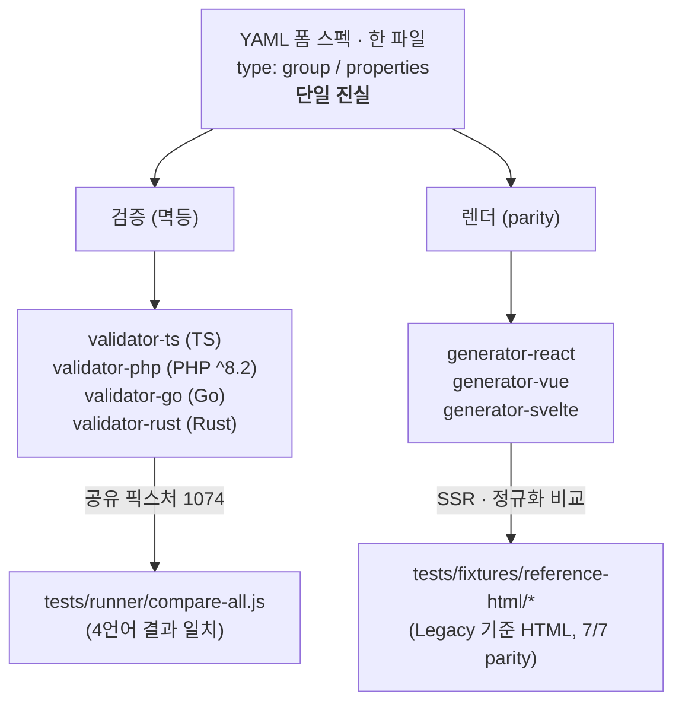

## 개요

Form-Spec 은 YAML 한 벌로 폼의 구조·검증 규칙·조건부 표시를 정의하고, 이를
여러 언어의 검증기와 여러 프레임워크의 렌더러가 **동일하게** 해석하는 시스템이다.

## 아키텍처



| 영역 | 패키지 | 비고 |
|------|--------|------|
| 검증기 | `validator-ts` (`@crudui/validator`) | TypeScript, 브라우저·Node |
| 검증기 | `validator-php` (`form-spec/validator`) | PHP ^8.2 |
| 검증기 | `validator-go` | `github.com/crudui/crudui/packages/validator-go` |
| 검증기 | `validator-rust` (`formspec-validator`) | Rust 크레이트 |
| 렌더 코어 | `generator-core` (`@crudui/generator-core`) | 프레임워크 무관 buildForm/buildList |
| 렌더러 | `generator-react` (`@crudui/generator-react`) | 기준 HTML 7/7 parity, list List |
| 렌더러 | `generator-vue` (`@crudui/generator-vue`) | SSR, 기준 HTML 7/7 parity, list List |
| 렌더러 | `generator-svelte` (`@crudui/generator-svelte`) | SSR, 기준 HTML 7/7 parity, list List |
| 도구 | `form-spec-cli` (`@crudui/cli`, bin `form-spec`) | describe/check/explain/list-widgets |

## 빠른 링크

- [문서 색인](/README) — 전체 문서 목차
- [schema (헌법)](/schema) — CRUDUI 단일 진실 · 역할 슬롯 · 조건맵 · 합성 · 금지키 게이트(§6) · list-spec(§9)
- [표현식 문법](/EXPRESSION-GRAMMAR) — 4언어 표현식 엔진 단일 진실 (토큰/AST/값 멱등, eval 금지)
- [form-spec CLI](/FORM-SPEC-CLI) · [form-spec MCP](/FORM-SPEC-MCP) — CRUDUI 작성 도구층
- 크로스-검증 콘솔 `examples/cross-check-console` — 4언어 검증 × 3프레임워크 SSR · list 탭
- [YAML 스펙 형식](/SPEC) — 스펙 작성법 (legacy 호환)
- [검증 규칙](/VALIDATION-RULES) — 규칙 레퍼런스
- [조건식 파서](/CONDITION-PARSER) · [조건부 표시 (legacy 호환)](/DISPLAY-CONDITIONS)
- [테스트 가이드](/TESTING) · [테스트 케이스](/TEST-CASES)
- [API 레퍼런스 (자동생성)](/api/) — 4언어 기계생성 API 문서
- [문서 자동생성 방법](/CONTRIBUTING-DOCS) — `make docs` 파이프라인

## 검증기 빠른 시작

```typescript
import { Validator } from '@crudui/validator';

const spec = {
  type: 'group',
  properties: {
    email: {
      type: 'email',
      rules: { required: true, email: true },
      messages: { required: 'Email is required' },
    },
  },
};

const result = new Validator(spec).validate({ email: '' });
// result: { valid: boolean, errors: ValidationError[] }
```

PHP / Go / Rust 의 동등 예시는 [문서 색인](/README#빠른-시작-검증기) 참조.
